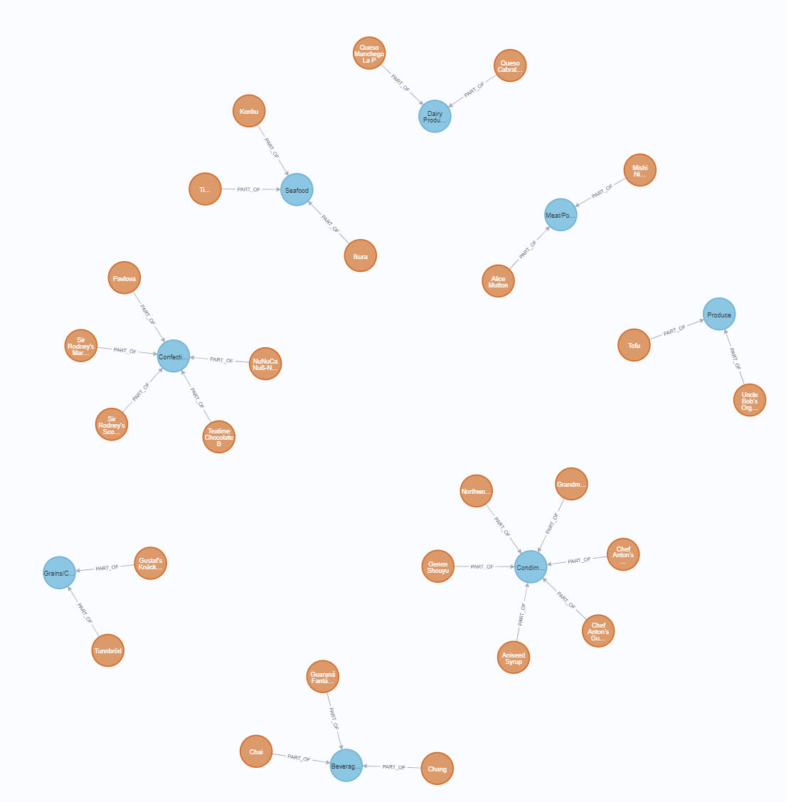
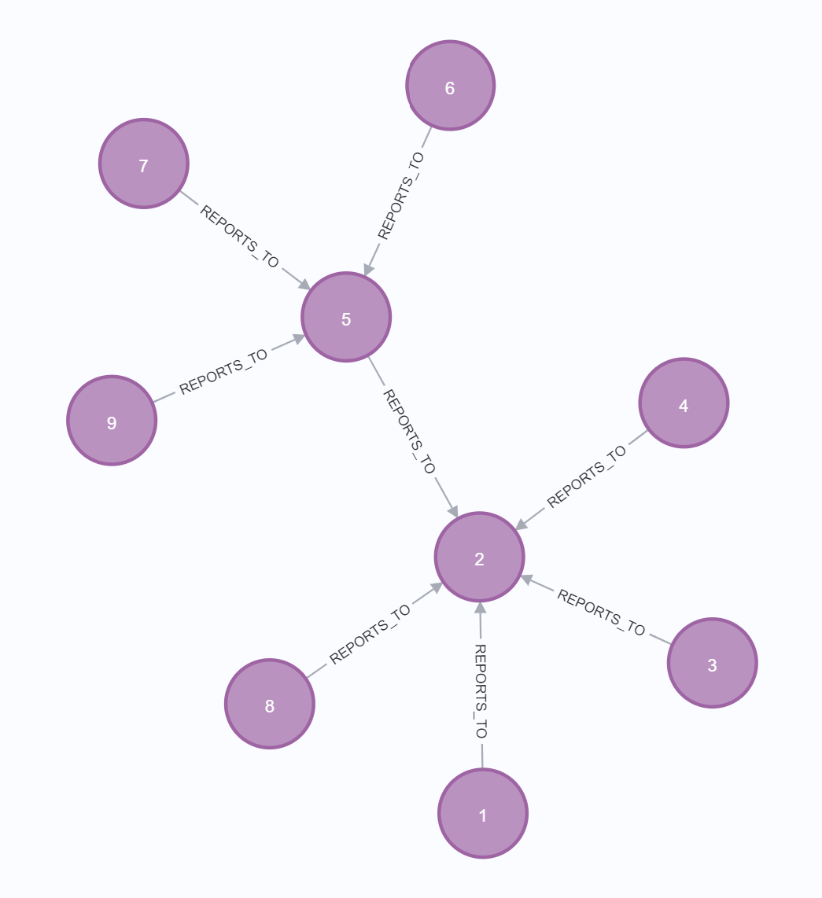

# ADT_project

In this project we want to compare and analyze the performances of Relational, Graph and Hybrid databases in context of recommendation system.

For this we have followed the below steps:

### Database Selection

#### Northwind Database
The Northwind sample database is based on a fictitious company called Northwind Traders, which imports and exports specialty foods from around the world. It is a commonly-used SQL datasets which are graphic enough.

#### Specifications-
size - 1.01 MB,
Relations - 13,
Tuples - 3308

###Relational Database
We have loaded the nothwind database into the sql server and performed some queries on it.

The following images depict the table from the executed queries

### Graph Database
We loaded the csv files into Neo4j. We defined the nodes and relationships to create the graph database using Cypher queries. 

The following images depict the graph database:

The following graph depicts products and category relationship

The following graph depicts employees and their managers

